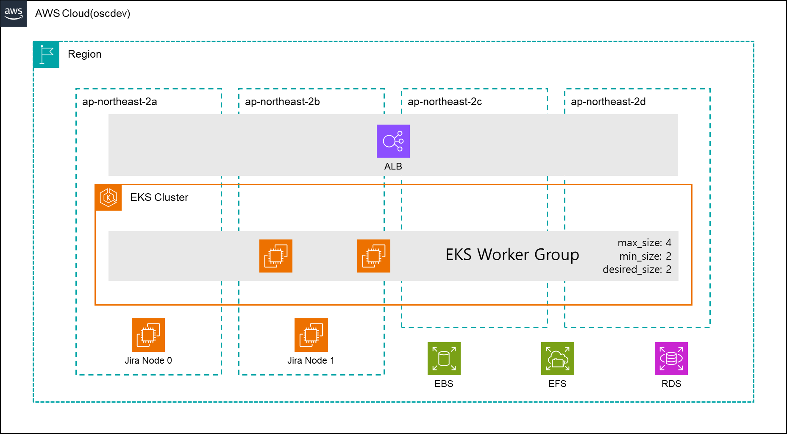
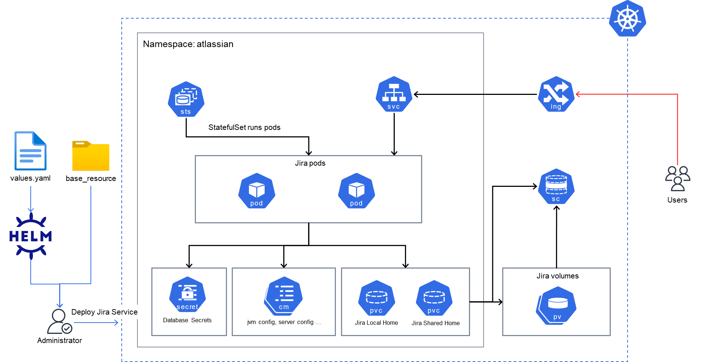

## Jira EC2 to EKS migration test resource

### Migration Plan

### Migration precondition
- EBS  encrypt type
- EBS Volume is same availability zone

### AWS
- [x] Network(vpc, subnet, ngw, igw, rtb ...)
- [x] EKS Cluster
    - [x] Worker Group
    - [x] EKS Add-on
        - [x] EBS CSI Driver
        - [x] EFS CSI Driver
- [x] EFS
- [x] RDS
- [x] EC2(Jira node)
    - [x] deploy ec2
    - [x] Jira installation
    - [x] Jira dummy data create

### Kubernetes
- [X] Helm Chart install
    - [X] ALB ingress controller
    - [X] Jira
- [X] Data migration
    - [X] Jira home directory

### Architecture

#### AWS

#### Kubernetes(EKS)

