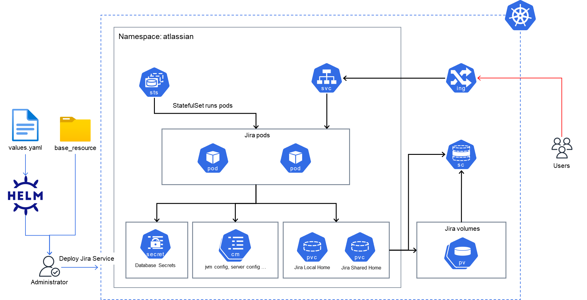

## Deploy Resource for EKS

`base_resource` Directory: Pre-deployment files required for Jira Helm chart deployment


### Chart Info
- REPOSITORY: `https://atlassian.github.io/data-center-helm-charts`
- CHART NAME: `atlassian-data-center/jira`
- CHART VERSION: `1.20.1`
- APP VERSION: `9.12.11`


### Architecture



### values.yaml details

```yaml
replicaCount: 2 
image:
  tag: "9.12.11"

database:
  type: "mysql8"
  url: "jdbc:mysql://<RDS-ENDPOINT>:<RDS-PORT>/eks-jira-tmp-db"
  driver: "com.mysql.cj.jdbc.Driver"
  credentials:
    secretName: jira-db-credentials
    usernameSecretKey: username
    passwordSecretKey: password

volumes:
  localHome:
    persistentVolumeClaim:
      create: false
      storageClassName: jira-ebs-sc
      resources:
        requests:
          storage: 100Gi
    persistentVolumeClaimRetentionPolicy:
      whenDeleted: Retain
      whenScaled: Retain
    mountPath: "/var/atlassian/application-data/jira"
  sharedHome:
    persistentVolumeClaim:
      create: false
      storageClassName: jira-efs-sc
      resources:
        requests:
          storage: 500Gi
    customVolume:
      persistentVolumeClaim:
        claimName: jira-shared-pvc
    mountPath: "/var/atlassian/application-data/shared-home"

ingress:
  create: true
  className: "alb"
  nginx: false
  maxBodySize: 250m
  proxyConnectTimeout: 60
  proxyReadTimeout: 60
  proxySendTimeout: 60
  host: <hostname>
  annotations: 
    # General
    alb.ingress.kubernetes.io/load-balancer-name: "sa2-eks-jira-alb"
    alb.ingress.kubernetes.io/load-balancer-attributes: idle_timeout.timeout_seconds=600
    # Ingress Core Settings
    alb.ingress.kubernetes.io/scheme: internet-facing
    # Health Check Settings
    alb.ingress.kubernetes.io/healthcheck-protocol: HTTP
    alb.ingress.kubernetes.io/healthcheck-path: /status
    alb.ingress.kubernetes.io/healthcheck-interval-seconds: '15'
    alb.ingress.kubernetes.io/healthcheck-timeout-seconds: '5'
    alb.ingress.kubernetes.io/success-codes: '200'
    alb.ingress.kubernetes.io/healthy-threshold-count: '2'
    alb.ingress.kubernetes.io/unhealthy-threshold-count: '2'
    # Sticky Sessions
    alb.ingress.kubernetes.io/target-group-attributes: stickiness.enabled=true,stickiness.lb_cookie.duration_seconds=604800
    alb.ingress.kubernetes.io/target-type: ip
    # SSL Settings
    alb.ingress.kubernetes.io/listen-ports: '[{"HTTPS":443}, {"HTTP":80}]'
    alb.ingress.kubernetes.io/certificate-arn: <ACM-CERTIFICATE-ARN>
    # redirect all HTTP to HTTPS
    alb.ingress.kubernetes.io/ssl-redirect: '443'
  https: true

jira:
  service:
    port: 80
    sessionAffinity: ClientIP
    enabled: true
  securityContext:
    fsGroup: 2001
  ports:
    http: 8080
    ecache: 40001
    ecacheobject: 40011
  readinessProbe:
    enabled: true
    initialDelaySeconds: 10
    periodSeconds: 5
    timeoutSeconds: 1
    failureThreshold: 10
    customProbe: {}
  startupProbe:
    enabled: false
    initialDelaySeconds: 60
    periodSeconds: 5
    failureThreshold: 120
  livenessProbe:
    enabled: false
    initialDelaySeconds: 60
    periodSeconds: 5
    timeoutSeconds: 1
    failureThreshold: 12
    customProbe: {}
  accessLog:
    mountPath: "/opt/atlassian/jira/logs"
    localHomeSubPath: "log"
  clustering:
    enabled: true
  shutdown:
    terminationGracePeriodSeconds: 30
    command: "/shutdown-wait.sh"
  resources:
    jvm:
      maxHeap: "768m"
      minHeap: "384m"
      reservedCodeCache: "512m"
    container:
      requests:
        cpu: "1"
        memory: "2G"
      #  limits:
      #   cpu: "2"
      #   memory: "2G"
  forceConfigUpdate: false
  additionalJvmArgs: 
    - "-Duser.timezone=Asia/Seoul"
  additionalLibraries:
    - volumeName: shared-home
      subDirectory:  jdbc-driver
      fileName: mysql-connector-j-8.4.0.jar
```


### ALB Ingress controller

```terraform
# Ingress-Controller Policy Attachment
resource "aws_iam_role_policy" "worker_alb_policy" {
  name   = "eks-worker-alb-policy"
  role  = module.eks.eks_managed_node_groups.sa2-eks_worker-group.iam_role_name
  policy = data.http.alb_policy.response_body
}

# Use AWS-ALB-Ingress-Controller Policy
data "http" "alb_policy" {
  url = "https://raw.githubusercontent.com/kubernetes-sigs/aws-load-balancer-controller/v2.8.1/docs/install/iam_policy.json"

  request_headers = {
    Accept = "application/json"
  }
}
```

```bash
helm repo add eks https://aws.github.io/eks-charts
helm install aws-load-balancer-controller eks/aws-load-balancer-controller -n kube-system --set clusterName=<cluster_name>
```


#### Using object
- none


### EBS & EFS CSI Driver

Include terraform file
- /terraform/eks-cluster/main.tf

```terraform
  cluster_addons = {
    coredns                = {}
    eks-pod-identity-agent = {}
    kube-proxy             = {}
    vpc-cni                = {}
    aws-efs-csi-driver     = {}
    aws-ebs-csi-driver     = {}
  }
```

```terraform
# EBS CSI Driver Policy Attachment
resource "aws_iam_role_policy" "worker_ebs_policy" {
  name   = "eks-worker-ebs-policy"
  role  = module.eks.eks_managed_node_groups.sa2-eks_worker-group.iam_role_name
  policy = data.http.ebs_policy.response_body
}

# Use EBS CSI Driver Policy
data "http" "ebs_policy" {
  url = "https://raw.githubusercontent.com/kubernetes-sigs/aws-ebs-csi-driver/master/docs/example-iam-policy.json"

  request_headers = {
    Accept = "application/json"
  }
}
```


#### Using object
- base_resource/efs-storageclass.yaml
- base_resource/efs-pv.yaml
- base_resource/efs-pvc.yaml


### Setting for use

#### base_resource/efs-pv.yaml
```
volumeHandle: <EFS-ID>:<PATH>
# example: volumeHandle: fs-12345678901234567:/eks
```